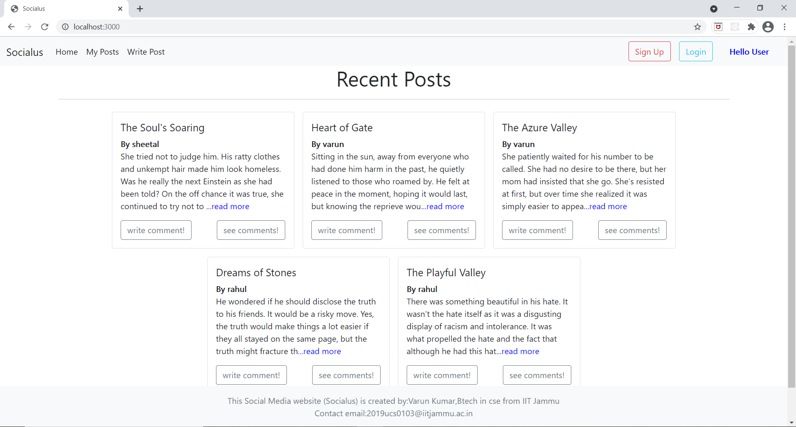

# Socialus
Socialus is a social media dynamic website where users can write post, see posts, write comments, see comments, delete their posts, etc features with proper login and sign up using passport local strategy and hashing user's password.
### Tools/technologies Used
1. frontend->html, css, javascript, jquery, handlebars, bootstrap.
2. database->mongodb, ODM-mongoose
3. backend->nodeJS
### Installation requirement 
npm install 
### Features
1. Proper sign up and login with authentication. Also it has validation for unique username and email id. Passwords are hashed before storing in database.

2. Recent Posts(home page with and without login):

3. Write Post and see your posts(even you can delete your posts):

4. Write comment and see comments of any post:

5. Read more(you can select any post and see it separately and bigger):

